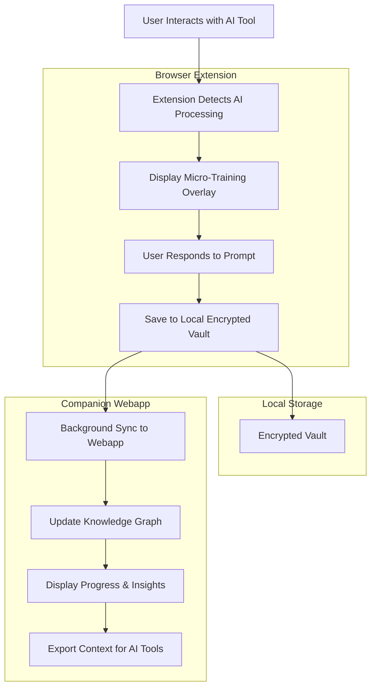
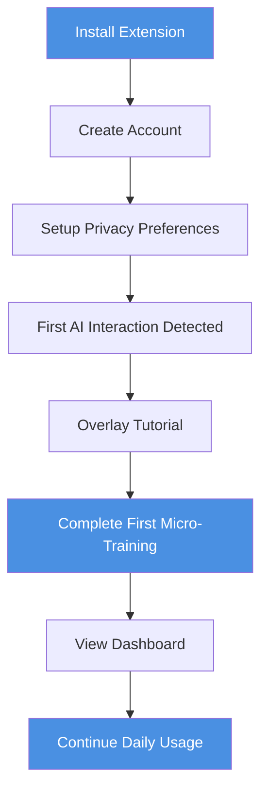
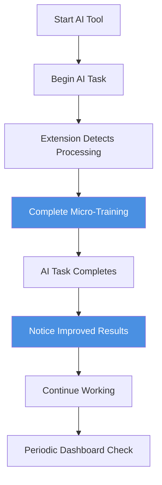

# SelfOS Phase 1 — Project Requirements Document (PRD)
**Version:** 1.0  
**Date:** October 5, 2025  
**Prepared by:** Product Manager Agent  
**Source:** Business Requirements Document v1.0  
**Target Audience:** Developer Agent, GitHub Copilot, Engineering Team  

**Tags:** `#phase1` `#prd` `#product-requirements` `#mvp` `#browser-extension` `#webapp` `#micro-training`

---

## Document Overview

This PRD translates the Phase 1 Business Requirements into actionable development specifications for the SelfOS micro-training system. The document provides detailed functional requirements, user stories, acceptance criteria, and technical specifications necessary for GitHub task creation and developer implementation.

**Primary Development Goal:** Build and validate a browser extension + companion webapp that captures micro-training data during AI wait times and demonstrates measurable AI personalization improvement.

---

## Product Architecture Overview



---

## Core Functional Requirements

### FR-001: AI Processing Detection
**Priority:** P0 (MVP Critical)  
**Component:** Browser Extension

**Description:** The browser extension must detect when external AI tools are processing user requests to trigger micro-training opportunities.

**Functional Specifications:**
- Detect AI processing through multiple methods:
  - DOM changes indicating loading states
  - Network request monitoring for AI API calls
  - Extension-specific hooks for supported platforms
  - User-triggered manual activation
- Support detection for: ChatGPT, Claude, Gemini, GitHub Copilot, Notion AI
- Minimum processing time threshold: 8 seconds before overlay activation
- Maximum overlay display time: 20 seconds

**Acceptance Criteria:**
- [ ] Extension correctly identifies AI processing >90% of the time across supported platforms
- [ ] No false positives on non-AI related loading states
- [ ] Overlay appears within 2 seconds of AI processing detection
- [ ] Overlay automatically dismisses when AI processing completes
- [ ] Manual trigger option available for unsupported AI tools

---

### FR-002: Micro-Training Overlay System
**Priority:** P0 (MVP Critical)  
**Component:** Browser Extension

**Description:** Display contextual micro-training prompts during AI wait times with minimal user interface disruption.

**Functional Specifications:**
- Overlay components:
  - Context bar with AI processing indicator
  - Prompt card with micro-question (≤12 words)
  - 2-3 quick response options or short text input
  - Skip option for user control
- Overlay positioning: Centered, non-blocking, 30% background dim
- Question types: Preference, tone, focus, domain-specific
- Response time target: <15 seconds average user interaction

**User Stories:**

**US-001: Display Contextual Prompt**
```
As an AI-driven developer waiting for code generation,
I want to see a relevant micro-question about my coding preferences,
So that I can incrementally train my AI context without disrupting my workflow.
```

**Acceptance Criteria:**
- [ ] Overlay displays within 2 seconds of trigger
- [ ] Questions are contextually relevant to detected AI task type
- [ ] UI follows SelfOS design system (#4A90E2 primary color)
- [ ] Keyboard navigation fully supported (Tab, Enter, Escape)
- [ ] Screen reader compatible with proper ARIA labels
- [ ] Mobile responsive design for tablet browsers

**US-002: Quick Response Collection**
```
As a knowledge worker using AI for document generation,
I want to quickly select my preference without typing,
So that I can provide context efficiently during short wait times.
```

**Acceptance Criteria:**
- [ ] Response options are clearly labeled and one-click accessible
- [ ] Support for both button selection and keyboard shortcuts
- [ ] Visual feedback on selection (highlight, checkmark)
- [ ] Option to add brief clarification text (optional)
- [ ] "Skip" option preserves user agency

---

### FR-003: Local Encrypted Data Vault
**Priority:** P0 (MVP Critical)  
**Component:** Browser Extension

**Description:** Securely store all micro-training responses locally with AES-256 encryption and user-controlled access.

**Functional Specifications:**
- Storage technology: IndexedDB with WebCrypto API
- Encryption: AES-256-GCM with user-derived key
- Data structure: Response, timestamp, source context, AI platform
- Storage limit: 50MB local storage (≈50,000 micro-interactions)
- Offline-first operation with deferred sync capability

**User Stories:**

**US-003: Secure Local Storage**
```
As a privacy-conscious user,
I want my micro-training data encrypted and stored locally,
So that I maintain complete control over my personal AI training information.
```

**Acceptance Criteria:**
- [ ] All data encrypted at rest using AES-256-GCM
- [ ] Encryption key derived from user credentials (never stored plaintext)
- [ ] Data remains accessible offline indefinitely
- [ ] No data transmitted without explicit user consent
- [ ] User can export complete vault as encrypted file
- [ ] User can delete individual entries or entire vault

**Data Schema:**
```json
{
  "id": "uuid",
  "timestamp": "ISO-8601",
  "question": "string",
  "response": "string|array",
  "context": {
    "aiPlatform": "string",
    "taskType": "string",
    "url": "string",
    "sessionId": "string"
  },
  "metadata": {
    "responseTime": "number",
    "confidence": "number",
    "tags": "array"
  }
}
```

---

### FR-004: Background Sync System
**Priority:** P0 (MVP Critical)  
**Component:** Browser Extension + Webapp Backend

**Description:** Synchronize encrypted vault data to companion webapp while maintaining privacy and handling offline scenarios.

**Functional Specifications:**
- Sync protocol: HTTPS POST with TLS 1.3
- Sync frequency: Every 5 minutes when online, immediate on webapp access
- Conflict resolution: Last-write-wins with user notification option
- Incremental sync: Only changed data since last sync
- Sync queue: Buffer offline changes for batch upload

**User Stories:**

**US-004: Seamless Data Sync**
```
As a user working across multiple devices,
I want my micro-training progress synchronized automatically,
So that my AI context is consistent regardless of where I interact.
```

**Acceptance Criteria:**
- [ ] Sync occurs transparently without user intervention
- [ ] Offline changes queued and transmitted when online
- [ ] Sync status visible in extension popup
- [ ] User can manually trigger sync
- [ ] Sync failures handled gracefully with retry logic
- [ ] Data consistency maintained across devices

---

### FR-005: Companion Webapp Dashboard
**Priority:** P0 (MVP Critical)  
**Component:** Web Application

**Description:** Provide visualization of micro-training progress, AI alignment metrics, and data management controls.

**Functional Specifications:**
- Dashboard sections:
  - Recent micro-trainings timeline
  - AI alignment progress metrics
  - Knowledge graph visualization
  - Data export/import controls
  - Privacy settings management
- Update frequency: Real-time when extension is active
- Export formats: JSON, CSV, embeddings (Phase 1 limited)

**User Stories:**

**US-005: Progress Visualization**
```
As a user building my AI context over time,
I want to see how my micro-trainings are improving AI alignment,
So that I can understand the value and progress of my personalization efforts.
```

**Acceptance Criteria:**
- [ ] Dashboard loads within 3 seconds
- [ ] Real-time updates when extension syncs data
- [ ] Visual progress indicators for key metrics
- [ ] Chronological list of recent micro-trainings
- [ ] Filterable by date range, AI platform, question type
- [ ] Export functionality for all stored data

**US-006: Knowledge Graph View**
```
As a curious user,
I want to explore how my preferences are interconnected,
So that I can understand my evolving digital identity and AI context.
```

**Acceptance Criteria:**
- [ ] Interactive node-link graph visualization
- [ ] Nodes represent preference categories (tone, focus, domain)
- [ ] Links show strength of relationships
- [ ] Hover interactions reveal details
- [ ] Zoom and pan controls for large graphs
- [ ] Option to export graph as image or data

---

### FR-006: AI Platform Integration Hooks
**Priority:** P1 (Phase 1 Extended)  
**Component:** Browser Extension

**Description:** Provide mechanisms for supported AI platforms to consume user context and improve responses.

**Functional Specifications:**
- Integration types:
  - Context injection via DOM modification
  - API parameter enhancement (where possible)
  - Custom instruction generation
  - Preference hint overlays
- Supported platforms: ChatGPT, Claude, Gemini (MVP)
- User consent required for each platform integration

**User Stories:**

**US-007: AI Context Enhancement**
```
As a user with established preferences,
I want my AI tools to automatically understand my tone and focus,
So that I don't need to repeatedly explain my preferences in each session.
```

**Acceptance Criteria:**
- [ ] User can enable/disable integration per AI platform
- [ ] Context injection occurs transparently
- [ ] No interference with normal AI platform functionality
- [ ] User can preview what context will be shared
- [ ] Integration can be easily disabled or modified

---

## Non-Functional Requirements

### NFR-001: Performance Requirements
**Priority:** P0 (MVP Critical)

**Specifications:**
- Extension memory footprint: <20KB runtime overhead
- Overlay display latency: <100ms from trigger
- Local vault write operations: <50ms
- Sync operation: <5 seconds for typical daily data
- Webapp dashboard load time: <3 seconds
- Knowledge graph rendering: <2 seconds for 1000 nodes

**Acceptance Criteria:**
- [ ] Performance metrics validated through automated testing
- [ ] No perceptible impact on host webpage performance
- [ ] Smooth animations and transitions <300ms
- [ ] Responsive UI on devices with 4GB+ RAM

### NFR-002: Security & Privacy Requirements
**Priority:** P0 (MVP Critical)

**Specifications:**
- Data encryption: AES-256-GCM at rest, TLS 1.3 in transit
- Key management: User-derived keys, no server-side key storage
- Data ownership: Complete user control over export/deletion
- Privacy compliance: GDPR, CCPA compliant data handling
- Telemetry: Opt-in only, aggregated and anonymized

**Acceptance Criteria:**
- [ ] Security audit passes for encryption implementation
- [ ] Privacy policy clearly explains data handling
- [ ] User can export all data in standard formats
- [ ] User can delete account and all associated data
- [ ] No tracking without explicit opt-in consent

### NFR-003: Compatibility Requirements
**Priority:** P0 (MVP Critical)

**Specifications:**
- Browser support: Chrome 90+, Firefox 88+, Safari 14+
- Operating systems: Windows 10+, macOS 10.15+, Linux (Ubuntu 20.04+)
- AI platform support: ChatGPT, Claude, Gemini, GitHub Copilot, Notion AI
- Offline functionality: Complete extension operation without internet
- Mobile browsers: Responsive design for tablet-sized screens

**Acceptance Criteria:**
- [ ] Extension installs and functions on all supported browsers
- [ ] UI scales appropriately across different screen sizes
- [ ] AI detection works on target platforms
- [ ] Offline mode preserves all functionality except sync

---

## Feature Prioritization & MVP Definition

### MVP (Minimum Viable Product) - Sprint 1-4
**Target Completion:** Month 3

**Core Features (P0):**
1. ✅ AI Processing Detection (FR-001)
2. ✅ Micro-Training Overlay System (FR-002)
3. ✅ Local Encrypted Data Vault (FR-003)
4. ✅ Basic Dashboard (FR-005 - minimal version)

**MVP Success Criteria:**
- Extension successfully captures 100+ micro-interactions per user
- >70% overlay completion rate
- <100ms response time for all interactions
- Successful data sync between extension and webapp

### Phase 1 Extended - Sprint 5-8
**Target Completion:** Month 6

**Enhanced Features (P1):**
1. ✅ Background Sync System (FR-004)
2. ✅ Full Dashboard with Analytics (FR-005)
3. ✅ Knowledge Graph Visualization (FR-006)
4. ✅ Basic AI Platform Integration (FR-007)

**Phase 1 Success Criteria:**
- 10,000+ registered users
- >30% daily active usage
- AI alignment improvement demonstrated
- User willingness to pay validated

### Future Considerations - Phase 2+
**Target Completion:** Month 12+

**Advanced Features (P2):**
1. Mobile app companion
2. Advanced AI twin functionality
3. Enterprise team features
4. Marketplace integrations
5. API for third-party developers

---

## User Journey Flows

### Primary User Journey: First-Time User


**Journey Acceptance Criteria:**
- [ ] New user completes first micro-training within 7 days
- [ ] Onboarding flow completion rate >80%
- [ ] User returns for second session within 48 hours
- [ ] Dashboard engagement >60% of new users

### Secondary User Journey: Daily Power User


**Journey Acceptance Criteria:**
- [ ] Daily users complete >5 micro-trainings per session
- [ ] <10% skip rate for engaged users
- [ ] Perceived AI improvement >25% after 30 days
- [ ] Dashboard check frequency >3 times per week

---

## Technical Implementation Guidance

### Development Stack Requirements

**Browser Extension:**
- **Framework:** React 18+ with TypeScript
- **State Management:** Zustand or Redux Toolkit
- **Build Tool:** Webpack 5+ with manifest v3 support
- **Testing:** Jest + React Testing Library
- **Linting:** ESLint + Prettier with SelfOS config

**Companion Webapp:**
- **Frontend:** React 18+ with Next.js 13+
- **Styling:** Tailwind CSS with SelfOS design system
- **Visualization:** D3.js for knowledge graph
- **State Management:** SWR for server state
- **Testing:** Jest + Cypress for E2E

**Backend Services:**
- **Runtime:** Node.js 18+ with Express.js
- **Database:** PostgreSQL 14+ for user data
- **Authentication:** Auth0 or similar OAuth provider
- **Deployment:** Docker containers on cloud platform
- **Monitoring:** Application performance monitoring

### Development Milestones

**Sprint 1 (Weeks 1-2): Foundation**
- [ ] Project setup and development environment
- [ ] Browser extension manifest and basic structure
- [ ] Local storage encryption implementation
- [ ] Basic React components for overlay

**Sprint 2 (Weeks 3-4): Core Detection**
- [ ] AI platform detection mechanisms
- [ ] Overlay trigger system
- [ ] Basic micro-training question engine
- [ ] Local vault data persistence

**Sprint 3 (Weeks 5-6): User Interface**
- [ ] Complete overlay UI implementation
- [ ] SelfOS design system integration
- [ ] Accessibility features (keyboard nav, ARIA)
- [ ] Extension popup interface

**Sprint 4 (Weeks 7-8): MVP Integration**
- [ ] Companion webapp foundation
- [ ] Basic dashboard implementation
- [ ] Sync system between extension and webapp
- [ ] MVP testing and bug fixes

**Sprint 5-8: Extended Features**
- [ ] Advanced dashboard analytics
- [ ] Knowledge graph visualization
- [ ] AI platform integration hooks
- [ ] Performance optimization and polish

### GitHub Project Structure

**Epic 1: Browser Extension Core**
- Task: Set up extension development environment
- Task: Implement AI processing detection
- Task: Create micro-training overlay system
- Task: Build local encrypted vault
- Task: Add extension popup interface

**Epic 2: Companion Webapp**
- Task: Set up Next.js webapp foundation
- Task: Implement user authentication
- Task: Create dashboard interface
- Task: Build knowledge graph visualization
- Task: Add data export/import functionality

**Epic 3: Data Sync System**
- Task: Design sync API endpoints
- Task: Implement encryption for data transport
- Task: Build offline queue management
- Task: Add conflict resolution logic
- Task: Create sync status monitoring

**Epic 4: AI Platform Integration**
- Task: Research integration possibilities for each platform
- Task: Implement context injection mechanisms
- Task: Build user consent management
- Task: Create integration testing framework
- Task: Add integration status monitoring

### Quality Assurance Requirements

**Testing Strategy:**
- **Unit Tests:** >80% code coverage for core functions
- **Integration Tests:** Critical user journey validation
- **E2E Tests:** Full extension-webapp workflow testing
- **Performance Tests:** Load testing for sync operations
- **Security Tests:** Encryption and data handling validation

**Release Criteria:**
- [ ] All P0 features complete and tested
- [ ] Performance benchmarks met
- [ ] Security audit passed
- [ ] Accessibility compliance verified (WCAG 2.1 AA)
- [ ] Cross-browser compatibility validated
- [ ] User acceptance testing completed

---

## Success Metrics & Monitoring

### Key Performance Indicators (KPIs)

**Product Metrics:**
- Micro-training completion rate: Target >70%
- Daily active usage: Target >30%
- User retention: 40% Day 7, 25% Day 30
- AI alignment improvement: >25% user-reported satisfaction

**Technical Metrics:**
- Extension performance: <20KB memory footprint
- Response latency: <100ms overlay display
- Sync reliability: >99% successful sync operations
- Uptime: >99.9% webapp availability

**Business Metrics:**
- User acquisition: 1,000+ users by Month 3
- Freemium conversion: >10% to paid tier
- Net Promoter Score: >50
- Customer support tickets: <2% of user base

### Monitoring & Analytics Implementation

**Technical Monitoring:**
- Application performance monitoring (APM)
- Error tracking and alerting
- Performance metric dashboards
- User behavior analytics (privacy-compliant)

**User Feedback Collection:**
- In-app feedback widgets
- Periodic user surveys
- User interview program
- Support ticket analysis

---

## Risk Mitigation & Contingency Plans

### Technical Risks

**Risk: Browser API Changes**
- **Mitigation:** Abstract browser APIs behind compatibility layer
- **Contingency:** Maintain fallback detection methods
- **Monitoring:** Subscribe to browser developer channels

**Risk: AI Platform Integration Breakage**
- **Mitigation:** Multiple detection methods per platform
- **Contingency:** User-triggered manual mode
- **Monitoring:** Automated platform compatibility testing

### Business Risks

**Risk: Low User Engagement**
- **Mitigation:** Extensive user research and testing
- **Contingency:** Pivot to different interaction models
- **Monitoring:** Real-time engagement analytics

**Risk: Privacy Regulation Changes**
- **Mitigation:** Privacy-by-design architecture
- **Contingency:** Rapid compliance update capability
- **Monitoring:** Legal and regulatory monitoring

---

## Handoff Specifications for Developer Agent

### Immediate Development Tasks

1. **Repository Setup**
   - Initialize monorepo with extension and webapp
   - Configure TypeScript, ESLint, Prettier
   - Set up CI/CD pipeline with GitHub Actions
   - Create development and staging environments

2. **Extension Foundation**
   - Implement manifest v3 configuration
   - Set up React development environment
   - Create basic popup and content script structure
   - Implement local storage encryption utilities

3. **Technical Architecture**
   - Design data models for micro-training responses
   - Implement IndexedDB wrapper with encryption
   - Create API client for webapp communication
   - Set up error handling and logging systems

### Development Guidelines

**Code Standards:**
- Follow TypeScript strict mode
- Use functional components with hooks
- Implement proper error boundaries
- Include comprehensive JSDoc comments
- Maintain test coverage >80%

**Security Requirements:**
- Validate all user inputs
- Sanitize DOM manipulations
- Use Content Security Policy
- Implement proper CORS handling
- Regular dependency security audits

**Performance Guidelines:**
- Lazy load non-critical components
- Implement proper caching strategies
- Optimize bundle sizes
- Use performance monitoring
- Conduct regular performance reviews

---

## Appendices

### A. Detailed User Stories Backlog

**Extension Core Features:**
- US-008: As a user, I want to customize micro-training frequency
- US-009: As a user, I want to pause micro-training during focus time
- US-010: As a developer, I want coding-specific context questions
- US-011: As a user, I want to review and edit my responses

**Dashboard Features:**
- US-012: As a user, I want to see my learning progress over time
- US-013: As a user, I want to export my data for backup
- US-014: As a user, I want to import data from other tools
- US-015: As a user, I want to share insights with team members

### B. API Specifications

**Sync API Endpoints:**
```
POST /api/v1/sync/upload
GET /api/v1/sync/download
PUT /api/v1/sync/resolve-conflict
DELETE /api/v1/sync/purge
```

**User Management:**
```
POST /api/v1/auth/register
POST /api/v1/auth/login
DELETE /api/v1/user/delete
GET /api/v1/user/profile
```

### C. Data Models

**User Profile Schema:**
```json
{
  "userId": "uuid",
  "preferences": {
    "frequency": "high|medium|low",
    "categories": ["tone", "focus", "domain"],
    "aiPlatforms": ["chatgpt", "claude", "gemini"]
  },
  "privacy": {
    "dataSharing": "full|minimal|none",
    "analytics": "enabled|disabled"
  }
}
```

---

**Document Status:** Ready for Developer Agent implementation  
**Review Schedule:** Weekly progress reviews with stakeholder feedback  
**Update Process:** Version control with change log maintenance  
**Approval Required:** Technical architecture review before Sprint 1 kickoff